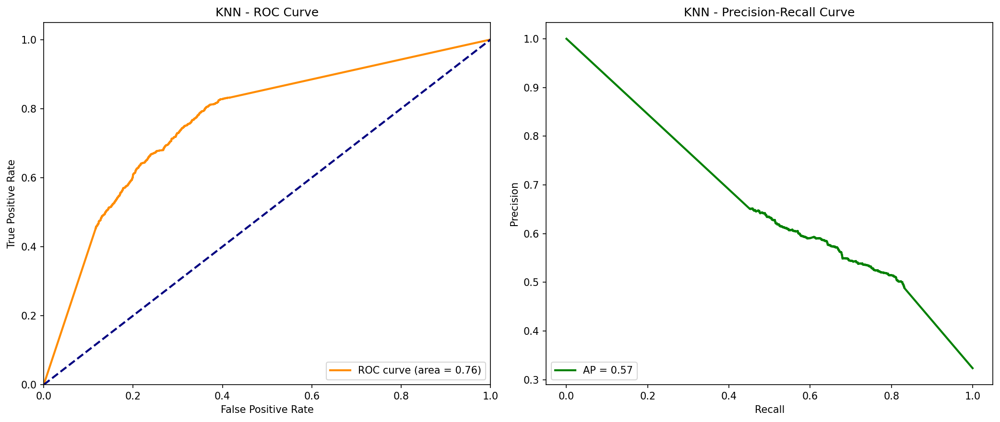

# 🏠 Airbnb Superhost Prediction

> **Business Analytics II – Project II**  
> Classifying Airbnb hosts as "Superhost" or "Non-Superhost" using machine learning

[](https://python.org)
[](https://scikit-learn.org)
[](https://jupyter.org)

---

## 📋 Overview

This project builds and compares **6 classification models** to predict whether an Airbnb host qualifies as a **Superhost** based on listing characteristics, reviews, and host behavior metrics.

### Key Objectives
- Exploratory Data Analysis (EDA) on Airbnb listing data
- Feature engineering and preprocessing pipeline
- Hyperparameter tuning with cross-validation
- Model comparison and performance evaluation
- SHAP-based feature importance analysis

---

## 🎯 Model Performance Results

After extensive **5-fold cross-validation** and hyperparameter tuning, here are the best results for each model:

| Model | Accuracy | Recall | F1-Score | Best Parameters |
|:------|:--------:|:------:|:--------:|:----------------|
| 🥇 **Random Forest** | **92.88%** | **94.68%** | **93.00%** | `n_estimators=100, max_depth=None` |
| 🥈 **MLP (Neural Network)** | 91.03% | 94.76% | 91.35% | `hidden_layers=(100,), alpha=0.001` |
| 🥉 **Decision Tree** | 88.93% | 93.77% | 89.44% | `max_depth=None, min_samples_split=2` |
| KNN | 82.93% | 94.41% | 84.69% | `n_neighbors=3, weights='distance'` |
| Logistic Regression | 79.79% | 81.89% | 80.21% | `C=0.1, solver='liblinear'` |
| Naive Bayes | 66.65% | 86.32% | 72.13% | `var_smoothing=1e-9` |

> 💡 **Winner**: Random Forest achieved the best overall performance with **92.88% accuracy**!

---

## 📊 Hyperparameter Tuning Visualizations

<table>
  <tr>
    <td align="center"><b>Random Forest</b></td>
    <td align="center"><b>Decision Tree</b></td>
  </tr>
  <tr>
    <td></td>
    <td></td>
  </tr>
  <tr>
    <td align="center"><b>MLP (Neural Network)</b></td>
    <td align="center"><b>KNN</b></td>
  </tr>
  <tr>
    <td></td>
    <td></td>
  </tr>
  <tr>
    <td align="center"><b>Logistic Regression</b></td>
    <td align="center"><b>Naive Bayes</b></td>
  </tr>
  <tr>
    <td></td>
    <td></td>
  </tr>
</table>

---

## 🤖 Models Evaluated

| Model | Description | Key Hyperparameters |
|:------|:------------|:--------------------|
| **Logistic Regression** | Baseline linear classifier | `C`, `solver` |
| **K-Nearest Neighbors** | Distance-based classification | `n_neighbors`, `weights` |
| **Naive Bayes** | Probabilistic classifier | `var_smoothing` |
| **Decision Tree** | Rule-based interpretable model | `max_depth`, `min_samples_split` |
| **Random Forest** | Ensemble of decision trees | `n_estimators`, `max_depth`, `min_samples_leaf` |
| **MLP** | Multi-layer perceptron classifier | `hidden_layer_sizes`, `activation`, `alpha` |

---

## 📁 Project Structure

```
ba2_team_project2/
├── 📓 processing.ipynb          # Main analysis & modeling notebook
├── 📓 dataset_prep.ipynb        # Data preprocessing & column filtering
├── 📊 train_data.csv            # Training dataset (26,304 samples, 54 features)
├── 📊 test_f25.xlsx             # Test dataset (130 samples)
├── 📊 prediction_result.xlsx    # Final prediction output
├── 📄 requirements.txt          # Python dependencies
├── 📂 results_extracted/        # Model evaluation visualizations
│   ├── *_plot.png/.svg          # Hyperparameter tuning plots
│   └── *_cv_results.csv         # Cross-validation results
└── 📄 README.md
```

---

## 🚀 Quick Start

### 1. Clone the repository
```bash
git clone https://github.com/YOUR_USERNAME/ba2_team_project2.git
cd ba2_team_project2
```

### 2. Install dependencies
```bash
pip install -r requirements.txt
```

### 3. Run the notebook
```bash
jupyter notebook processing.ipynb
```

---

## 📦 Dependencies

```
pandas==2.2.3
numpy==2.1.1
matplotlib==3.10.1
seaborn==0.13.2
scikit-learn==1.6.1
openpyxl==3.1.5
umap-learn
```

---

## 📊 Key Features Used

The model leverages various Airbnb listing attributes including:

| Category | Features |
|:---------|:---------|
| **Host Info** | Response rate, Response time, Identity verified |
| **Listing Details** | Room type, Price, Beds, Availability |
| **Reviews** | Number of reviews, Review scores (cleanliness, location, value, etc.) |
| **Booking** | Minimum/Maximum nights, Instant bookable |

---

## 🔬 Methodology

1. **Data Preprocessing**
   - Handling missing values
   - Feature encoding (Label Encoding, One-Hot Encoding)
   - Feature scaling (StandardScaler)

2. **Model Training**
   - 5-Fold Stratified Cross-Validation
   - GridSearchCV for hyperparameter tuning
   - Multiple scoring metrics (Accuracy, Recall, F1-Score)

3. **Model Evaluation**
   - Confusion Matrix Analysis
   - Classification Report
   - SHAP Feature Importance

---

## 👤 Author

**손영진 (Youngjin Son)**  
Student ID: 2020120083  
Course: Business Analytics II, Fall 2025

---

## 📝 License

This project is for educational purposes as part of the Business Analytics II course.

---

<p align="center">
  <i>⭐ If you found this project helpful, please consider giving it a star!</i>
</p>
